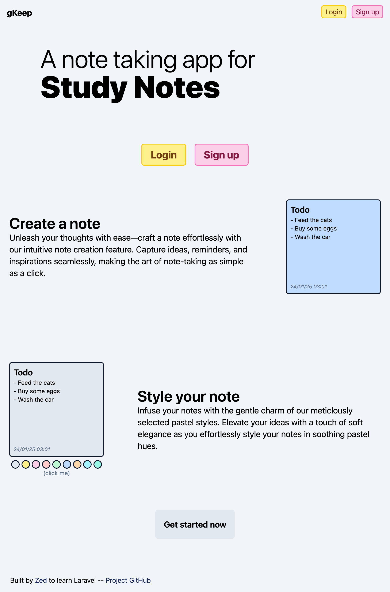
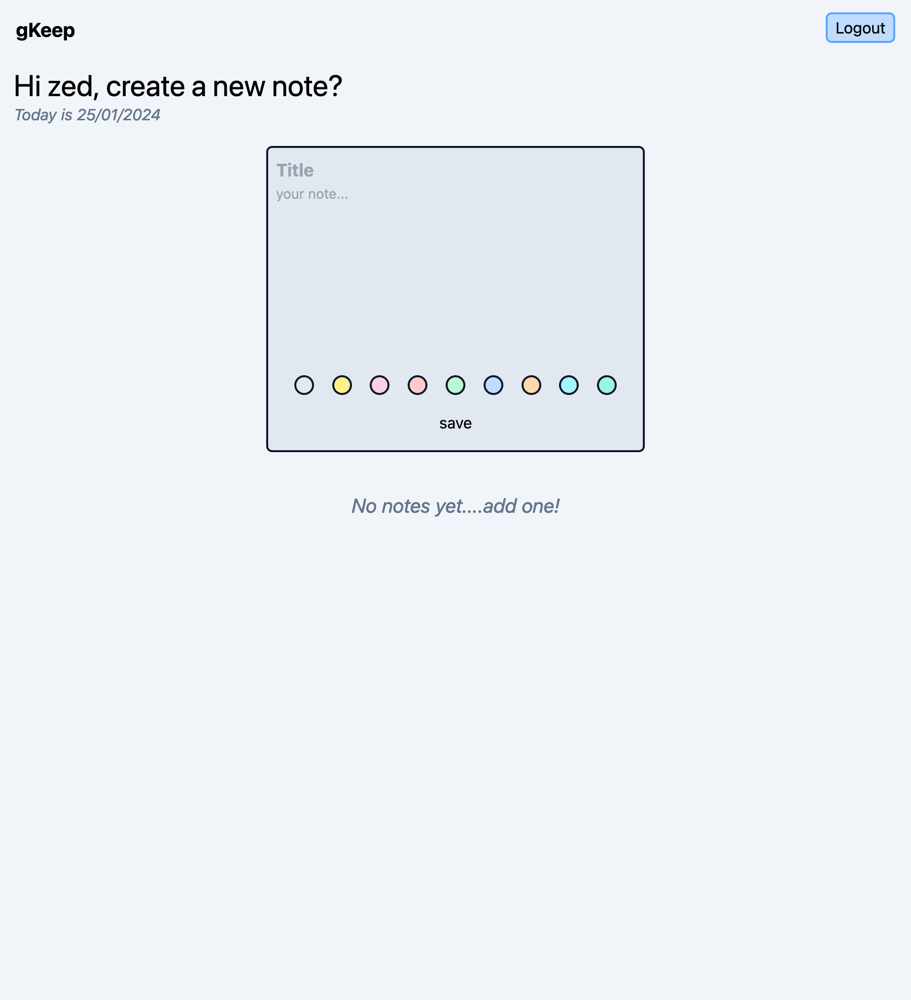
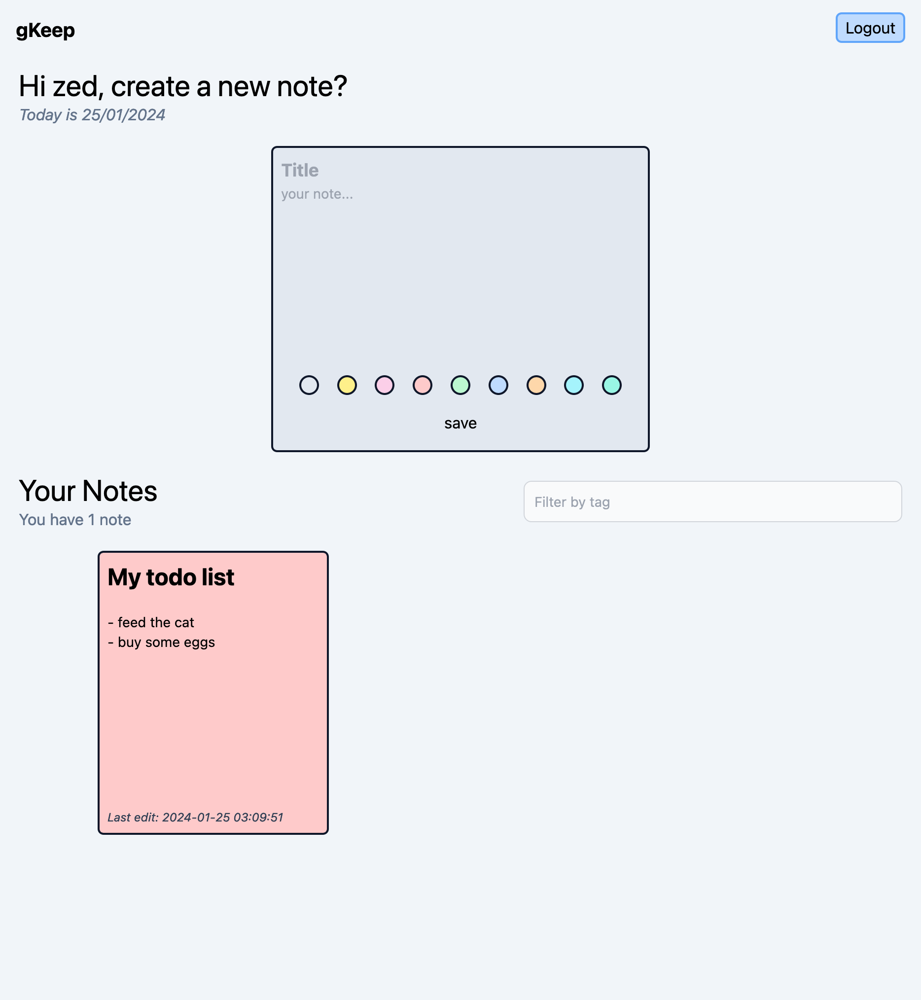
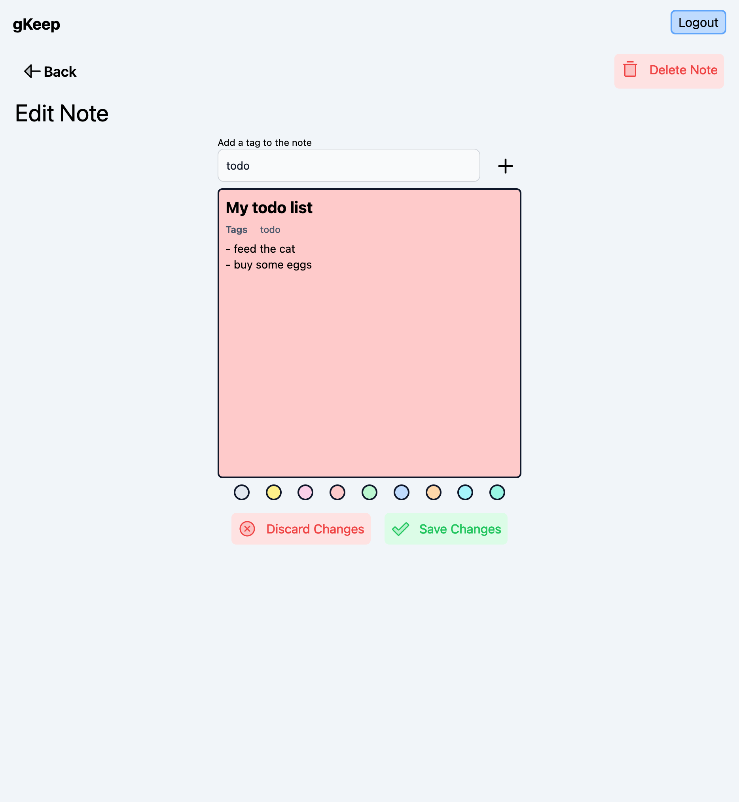

# gKeep
A simple Google Keep clone built with PHP and Laravel

Uses Tailwind CSS for styling. Design is responsive and works on mobile/small screen sizes.

The UI design is simple as it wasn't a focus of this project

## Functionality

- user authorization and authentication
- multiple note colours
- add tags to notes
- filter notes by tag

### Improvements

- migrate from textarea to a text editor that supports markdown (EasyMDE?)

## Pictures

